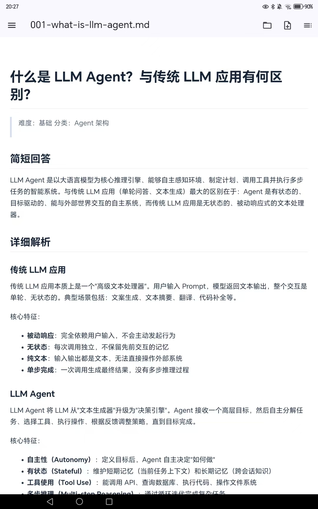
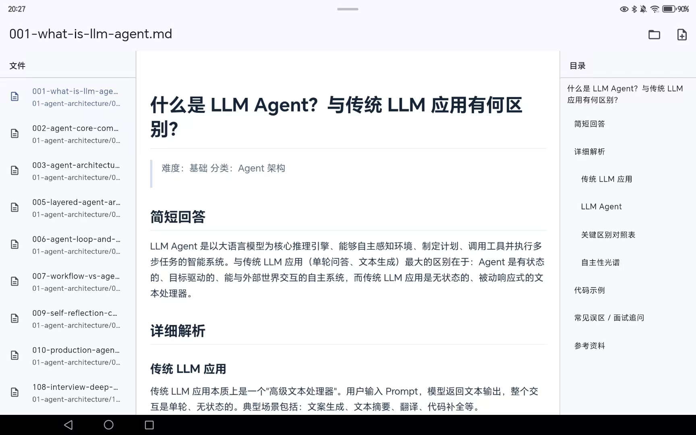
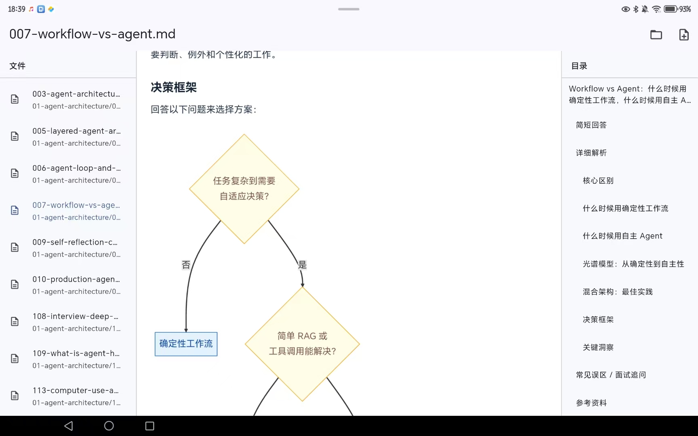

# StillMD · 简阅 MD

一款离线 Android Markdown 阅读器。打开本地文件或文件夹，在手机和平板上阅读 Markdown 文档。

## 下载与安装

前往 [Releases](https://github.com/yanmengssss/still-md/releases) 下载最新版 `StillMD-v*.apk`，在 Android 设备上打开安装。首次安装时，系统可能要求允许当前文件管理器安装应用。

> Release 页面中的 **Source code** 是源码压缩包；请下载 **Assets** 下的 APK 安装包。

## 界面预览

| 手机阅读 | 平板三栏 | Mermaid 图表 |
| --- | --- | --- |
|  |  |  |

## 功能

- 通过 Android 系统文件选择器打开单个 `.md` / `.markdown` 文件，或授权一个文件夹并浏览其中的 Markdown 文件。
- 递归列出文件夹中的文档；通过文件列表快速切换。
- 渲染 GitHub 风格 Markdown、表格和 Mermaid 图表。Mermaid 脚本随应用打包，可离线使用。
- 按标题生成目录并跳转；手机上使用抽屉，平板横屏时显示三栏布局。
- 支持读取已授权文件夹内的相对路径图片，并记住上次打开的文件或文件夹。

应用无需账号或后端，也不申请宽泛的存储权限。单独打开文件时，Android 只授权该文件；如果文档引用同目录图片，请改为打开所在文件夹。

## 从源码运行

需要 Flutter SDK、Android SDK 和一台 Android 设备或模拟器。

```sh
flutter pub get
flutter run
```

本地构建调试 APK：

```sh
flutter build apk --debug
```

正式 APK 需要自己的 Android 签名证书。构建脚本从 `android/key.properties` 读取签名配置；此文件和证书不随源码提供，也不能提交。配置格式如下，`storeFile` 使用相对于 `android/app` 的路径或绝对路径：

```properties
storeFile=/path/to/your/release.p12
storePassword=your-store-password
keyAlias=your-key-alias
keyPassword=your-key-password
```

配置后运行 `flutter build apk --release`，产物位于 `build/app/outputs/flutter-apk/app-release.apk`。发布应用更新时必须沿用相同证书，并递增 `pubspec.yaml` 中版本号 `+` 后的构建号。

## 维护者：发布新版本

发布脚本在本机完成正式构建，并通过 GitHub 官方 API 创建附带 APK 和 SHA-256 校验文件的 Release。它要求源码已经提交并推送、工作区干净、本机签名配置可用，且 Git 已登录 GitHub（例如可以正常执行 `git push`）。脚本从 Git 凭据管理器临时读取 GitHub 凭据，只用于此次 API 请求；Android 证书与密码只用于本机构建，不会作为源码或 Release 附件上传。

```powershell
flutter pub get
.\scripts\publish-release.ps1
```

脚本读取 `pubspec.yaml` 中的版本号，创建对应的 `vX.Y.Z` Release。发布前先更新版本号、提交并推送代码。若本机未把 Flutter 加入 PATH，可传入可执行文件路径：

```powershell
.\scripts\publish-release.ps1 -Flutter 'C:\path\to\flutter\bin\flutter.bat'
```

## 安全与许可

`.gitignore` 排除了本地签名证书、`android/key.properties`、本机 SDK 路径、构建产物和缓存。提交前仍应运行 `git status` 检查待提交文件；不要在 Issue、日志或截图中公开密码。

项目源码采用 [MIT License](LICENSE)。随应用提供的 Mermaid 代码保留其原始许可证，见 [assets/MERMAID-LICENSE](assets/MERMAID-LICENSE)。
